---

marp: true
theme: tabreturn
notes: ...
<!--
- PRESENT: marp -w -p --html --theme ./theme/tabreturn.css slidedeck.md
- PDF:     marp -o slidedeck.pdf --html --allow-local-files --theme ./theme/tabreturn.css slidedeck.md
-->

---

# ***Mitigating AI Misuse in Introductory Python Courses with Graphical Programming Tasks***
<!-- 
_backgroundImage: "url(./theme/tabreturn_title_bg.png)"
_backgroundRepeat: "repeat"
_backgroundSize: "325px"
_color: var(--color-background)
-->
*Kiwi Pycon 2025*

---

# Introduction
<!-- 
paginate: true
backgroundColor: darkslategrey
color: var(--color-background)
-->

---

## Introduction > me
* Graphic designer → web designer → web designer & developer → multimedia developer → 
* Lecturer in Creative Technologies / Interaction Design
* Active in open-source development, and author of Python book
* Increasing grappling with what to teach and how to teach it ...

---

## Introduction > Processing
### ... anybody heard of it?
* Graphics library and IDE made for teaching non-programmers programming in a visual way
* Easy to learn, especially for beginners, promoting software literacy within the visual arts
* Great for coding animations, generative art, data visualisations
* Based on Java with simple functions for drawing and motion

---

<!-- 
_paginate: false
_backgroundColor: white
-->
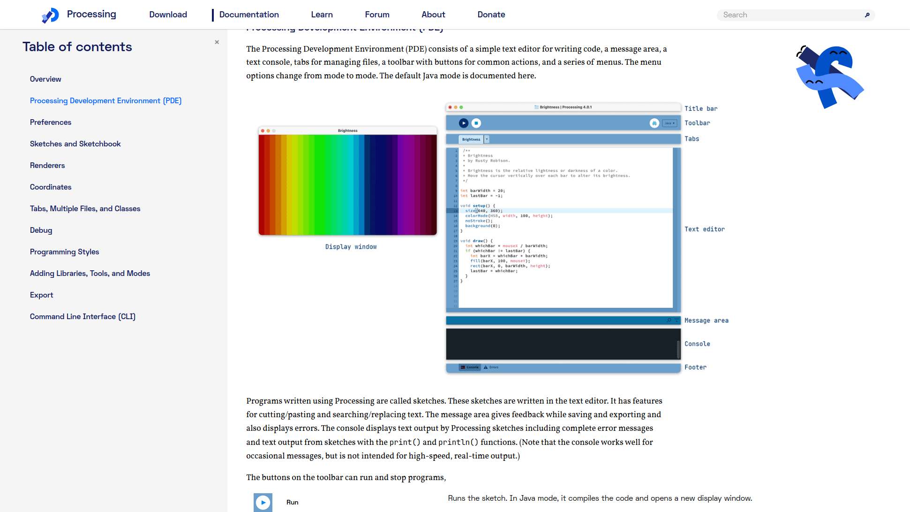
> https://processing.org

---

## Introduction > Processing derivatives
* <highlight>p5.js</highlight> -- JavaScript version for the web (runs in browsers)
* <highlight>JRubyArt</highlight> -- A wrapper for Processing in the Ruby language
* <highlight>Processing Android</highlight> -- Run Processing sketches on Android devices
* ... several others targeting different languages ...
* <highlight>Processing.py</highlight> -- Uses Python instead of Java

---

<!-- 
_paginate: false
_backgroundColor: white
-->

---

## Introduction > Jython Limitations
* No Support for Python 3
* Limited CPython C-Extension Support (e.g. no NumPy support)
* That said, Processing.py is effectively discontinued (incompatible with Processing 4)

---

# Thonny-py5mode
<!-- 
backgroundColor: maroon
-->

---

## Thonny-py5mode > Motivation
<!-- 
backgroundColor: maroon
-->

A new (Python 3) enviroment that emulates the Processing IDE, serving as a successor to Processing.py.

---

<!-- 
_paginate: false
_backgroundColor: white
-->
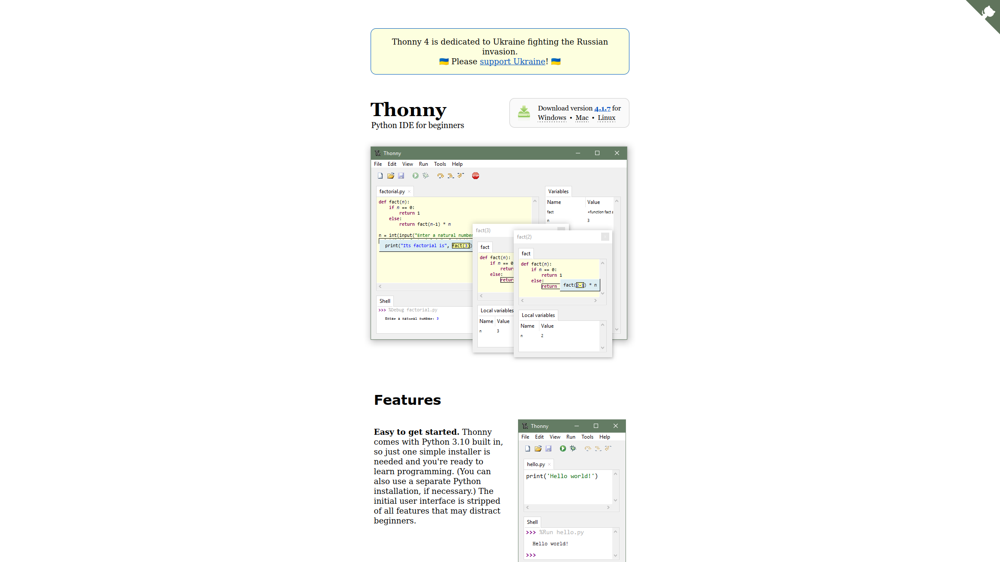
> https://thonny.org

---

<!-- 
_paginate: false
_backgroundColor: white
-->
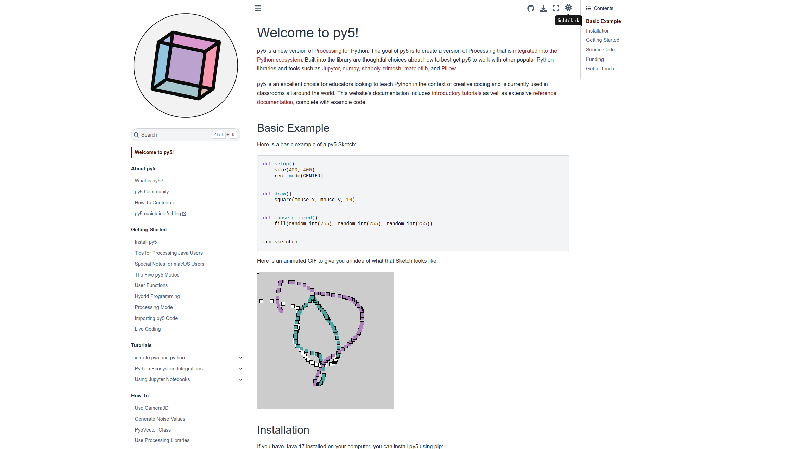
> https://py5coding.org

---

<!-- 
_paginate: false
_backgroundColor: white
-->
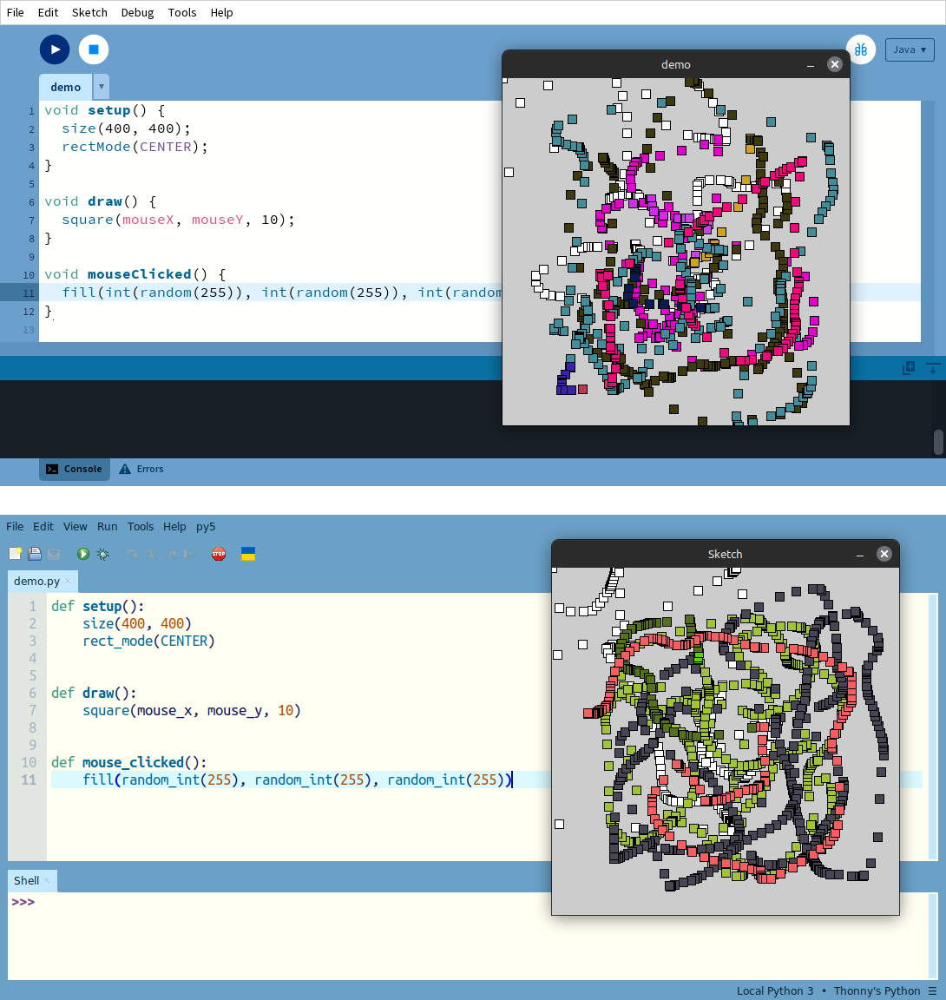

---

## Thonny-py5mode > Features
* Leverages the py5 library, which incorporates JPype
* JPype supports Python 3
* JPype supports 3rd-party Python libraries with C extensions
* More at https://py5coding.org (including Jupyter Notebook integration)

---

<!-- 
_paginate: false
_backgroundColor: white
-->
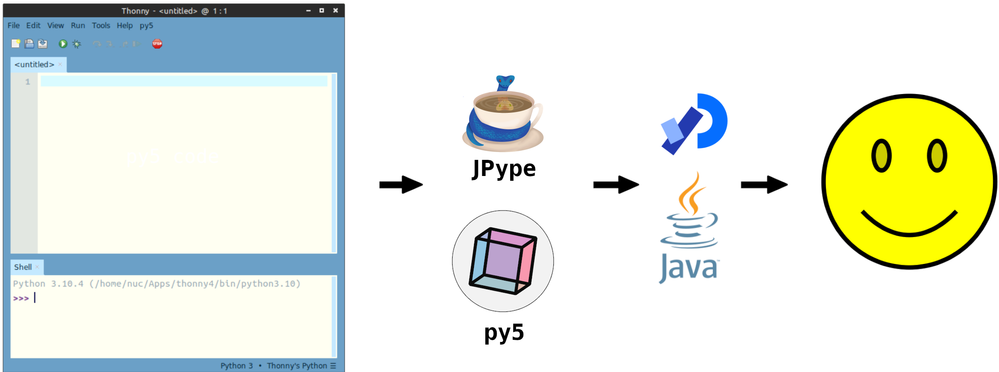

---

<!-- 
_paginate: false
_backgroundColor: white
-->
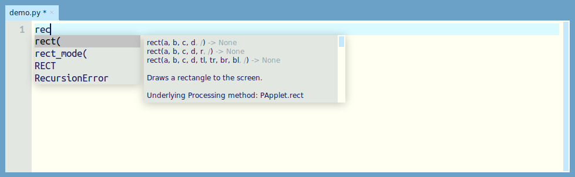

---

<!-- 
_paginate: false
_backgroundColor: white
-->
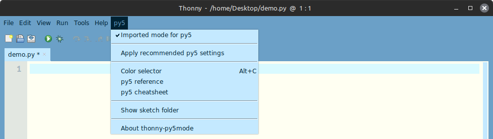

---

<!-- 
_paginate: false
_backgroundColor: white
-->

---

<!-- 
_paginate: false
_backgroundColor: white
-->

---

<!-- 
_paginate: false
_backgroundColor: white
-->
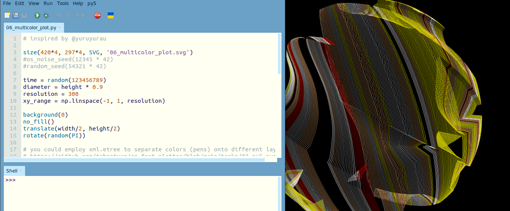

---

<!-- 
_paginate: false
_backgroundColor: white
-->

---

<!-- 
_paginate: false
_backgroundColor: white
-->

---

<!-- 
_paginate: false
_backgroundColor: white
-->
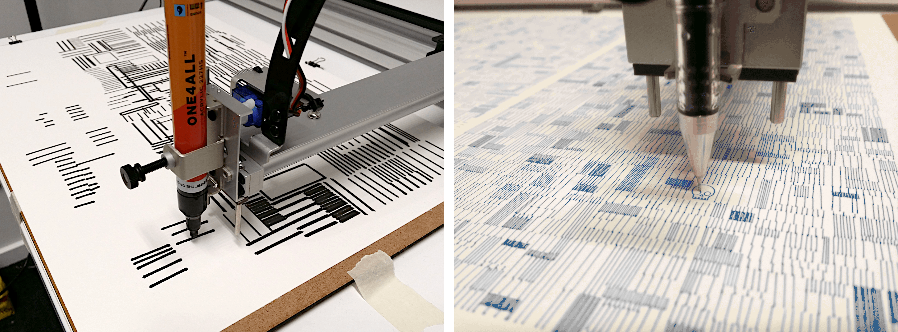

---

<!-- 
_paginate: false
_backgroundColor: white
-->

---

<!-- 
_paginate: false
_backgroundColor: white
-->

---

<!-- 
_paginate: false
_backgroundColor: white
-->
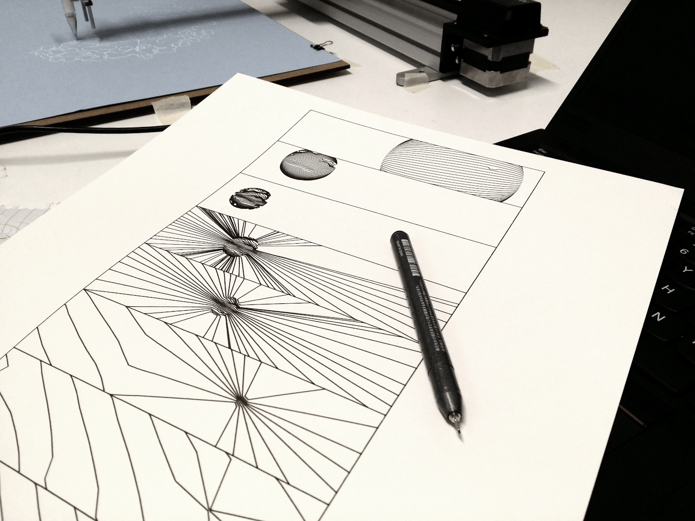

---

# Assessment
<!-- 
paginate: true 
backgroundColor: indigo
color: var(--color-background)
-->

---

## Assessment > GenAI Challenges & Opportunities
Research has shown that --
* GPT-4 is close to human tutors for hints/debugging
* Chatbots (e.g. Graasp Bot) help beginners (less so for complex tasks)
* Students appreciate GenAI (but fear accuracy and fairness issues)
* LLM assistants are converging with Intelligent Tutoring Systems (ITS)
* Systems like PyTutor improve engagement/performance (but risk dependence)

---

## Assessment > GenAI Creative Coding Opportunities

* ShiffBot (p5.js): AI tutor based on Daniel Shiffman's teaching
* Uses Retrieval-Augmented Generation for context-aware help

---

<!-- 
_paginate: false
_backgroundColor: white
-->
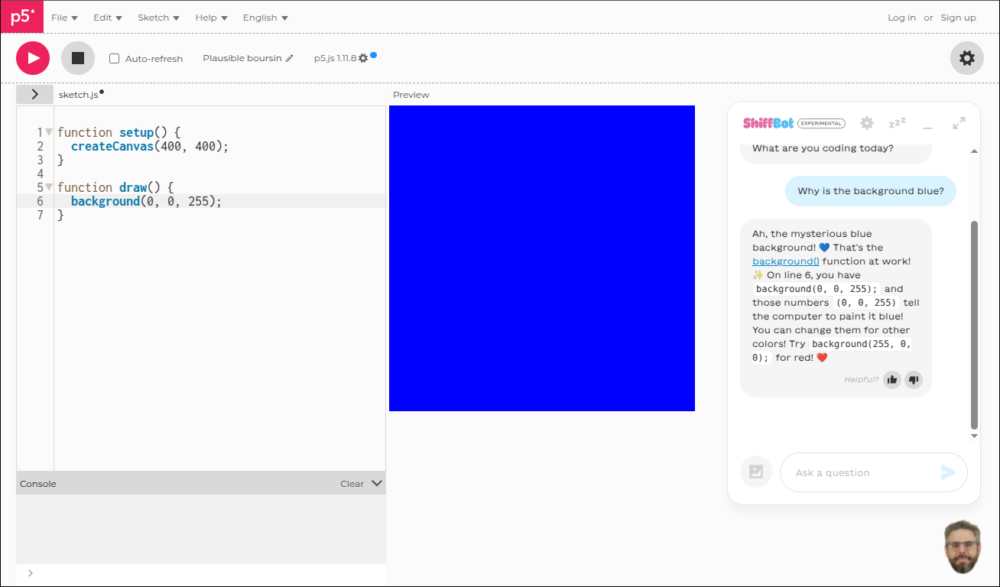
> https://shiffbot.withgoogle.com

---

## Assessment > GenAI Creative Coding Opportunities

- ShiffBot (p5.js): AI tutor based on Daniel Shiffman's teaching
- Uses Retrieval-Augmented Generation for context-aware help
- No Python equivalent yet, <highlight>but py5 + Anaconda Assistant shows potential</highlight>

---

<!-- 
_paginate: false
_backgroundColor: white
-->
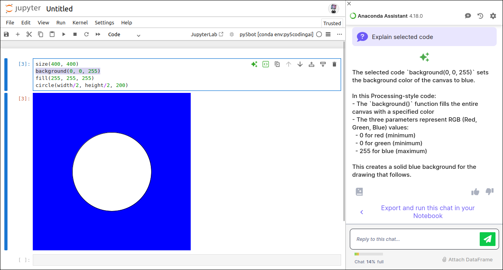
> https://py5coding.org/content/install.html#jupyter-notebook-kernels

---

## Assessment > Strategies > Code Tracking & Authorship

- Stylometric analysis of code patterns
- Logging edit histories; staged submissions
- Secure, proctored exams (ethical concerns noted)

---

## Assessment > Strategies > Integrity Culture & Engagement

- Clear policies on AI use and citation
- Reflection tasks and honour pledges
- Encourage help-seeking, discuss ethical use

---

## Assessment > Strategies > Assessment Design & Exposition

- Personalised or parameterised tasks
- Reflective and viva assessments
- Scaffolded deliverables and code reviews

---

<!-- 
_paginate: false
_backgroundColor: white
-->

> [McDanel & Novak (2025)](https://ednovak.net/documents/novak_mcdanel_sigcse_ts_2025_llm_hw_paper.pdf)

---

<!-- 
_paginate: false
_backgroundColor: white
-->

> [McDanel & Novak (2025)](https://ednovak.net/documents/novak_mcdanel_sigcse_ts_2025_llm_hw_paper.pdf)

---

# Thonny-py5mode Tasks
<!-- 
paginate: true 
backgroundColor: darkslateblue
color: var(--color-background)
-->

---

## Thonny-py5mode Tasks > Original

*Task 1: Coding for simple loops 1.*

*Complete the following programming exercises using python programming language:*
- *Print first 10 numbers using while loop (e.g., 1, 2, 3, ..., 8, 9, 10)*
- *Print first 10 even numbers using for loop (e.g., 2, 4, ..., 18, 20)*
- *Print first 10 odd numbers using while loop (e.g., 1, 3, ..., 17, 19)*
- *Print sum of first 10 numbers using for loop*

---

## Thonny-py5mode Tasks > replacement
### Keep the task complexity the same, but mitigate GenAI misuse through graphics

---

<!-- 
_paginate: false
_backgroundColor: white
-->

---

<!-- 
_paginate: false
_backgroundColor: white
-->

---

<!-- 
_paginate: false
_backgroundColor: white
-->

---

<!-- 
_paginate: false
_backgroundColor: white
-->

---

<!-- 
_paginate: false
_backgroundColor: white
-->
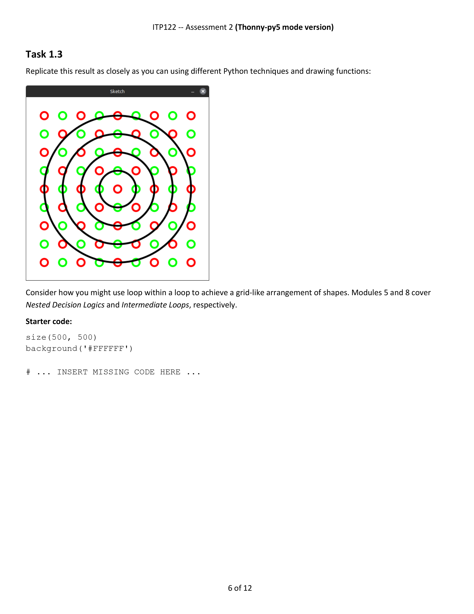

---

## Thonny-py5mode Tasks > Results

- Thonny-py5mode assessment (Weeks 5–8) tested six visual challenges.
- LLMs (Claude, Gemini, GPT-4o) all failed to reproduce graphics reliably.
  - Missed shapes, colours, layering.
  - Outputs appeared as flawed approximations.

---

<!-- 
_paginate: false
_backgroundColor: white
-->
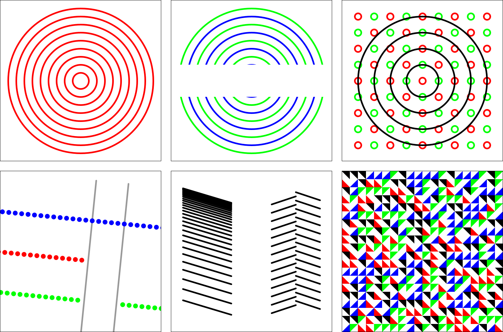

---

<!-- 
_paginate: false
_backgroundColor: white
-->
<pre style="color:#000;font-size:19.5px;margin-top:90px;">        task             Claude Sonnet 4       Gemini 2.5 Flash        OpenAI GPT-4o</pre>
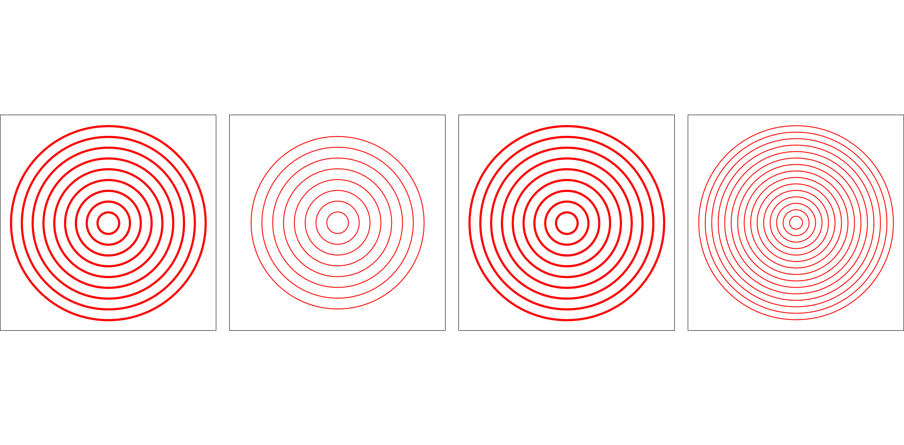

---

<!-- 
_paginate: false
_backgroundColor: white
-->
<pre style="color:#000;font-size:19.5px;margin-top:90px;">        task             Claude Sonnet 4       Gemini 2.5 Flash        OpenAI GPT-4o</pre>
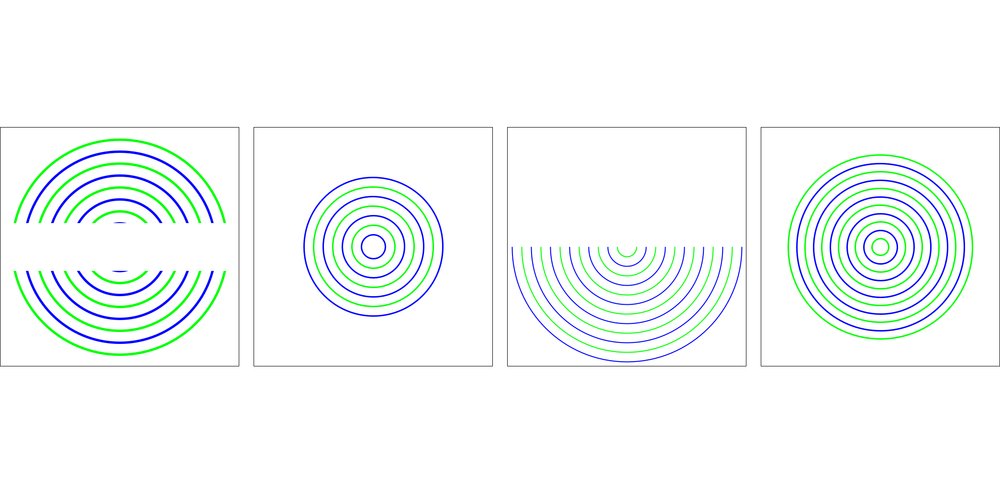

---

<!-- 
_paginate: false
_backgroundColor: white
-->
<pre style="color:#000;font-size:19.5px;margin-top:90px;">        task             Claude Sonnet 4       Gemini 2.5 Flash        OpenAI GPT-4o</pre>
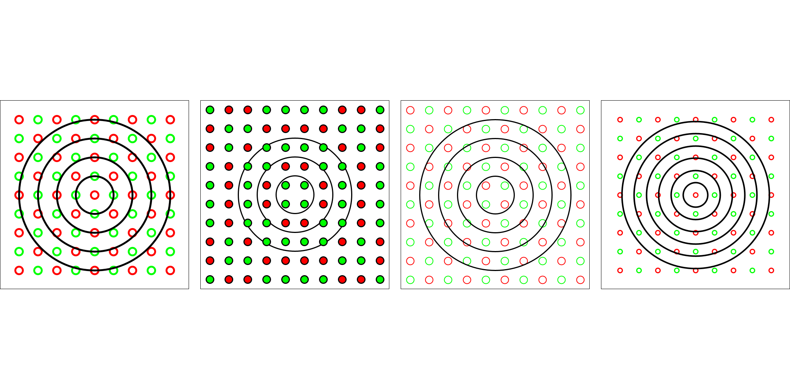

---

<!-- 
_paginate: false
_backgroundColor: white
-->
<pre style="color:#000;font-size:19.5px;margin-top:90px;">        task             Claude Sonnet 4       Gemini 2.5 Flash        OpenAI GPT-4o</pre>
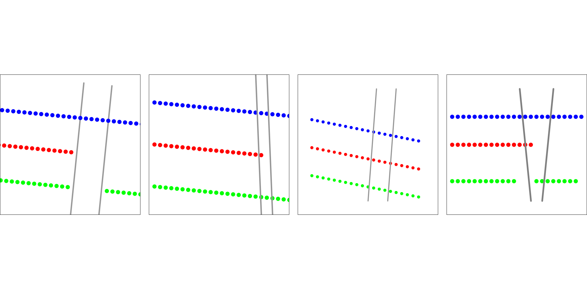

---

<!-- 
_paginate: false
_backgroundColor: white
-->
<pre style="color:#000;font-size:19.5px;margin-top:90px;">        task             Claude Sonnet 4       Gemini 2.5 Flash        OpenAI GPT-4o</pre>

---

<!-- 
_paginate: false
_backgroundColor: white
-->
<pre style="color:#000;font-size:19.5px;margin-top:90px;">        task             Claude Sonnet 4       Gemini 2.5 Flash        OpenAI GPT-4o</pre>
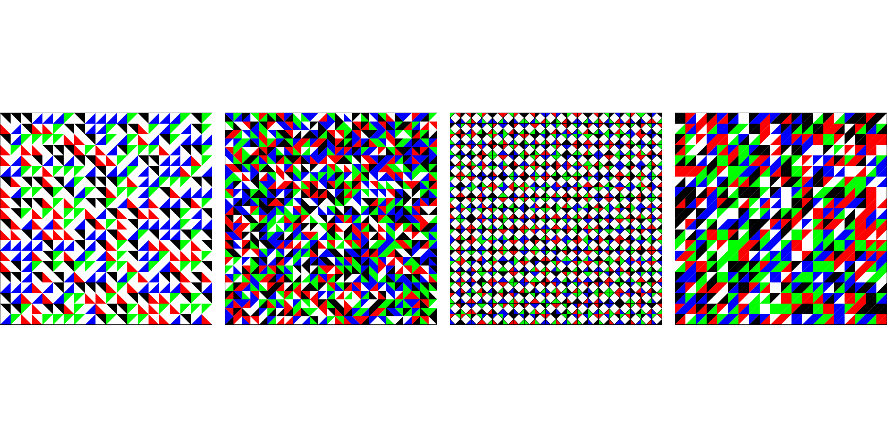

---

## Thonny-py5mode Tasks > Future Work
* Test iterative prompting and documentation context
* Compare py5, p5.js, Pillow for visual reasoning
* Explore animation and personalised variants
* Develop grading rubrics balancing code vs visual output

---

## *End*
<!-- 
paginate: false 
backgroundColor: black
color: var(--color-background)
-->

