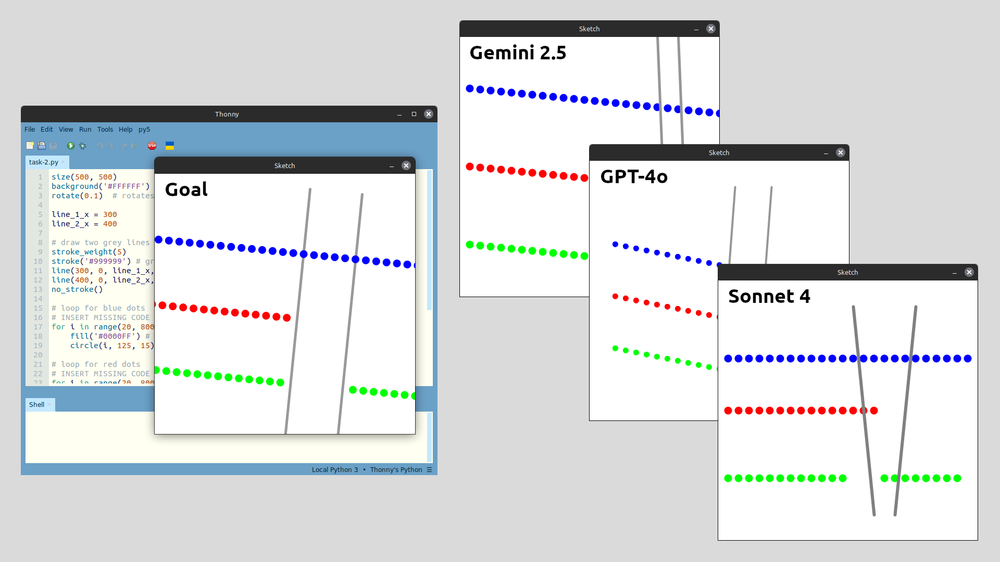

# ***Mitigating AI Misuse in Introductory Python Courses with Graphical Programming Tasks***
<!-- 
_backgroundImage: "url(./theme/tabreturn_title_bg.png)"
_backgroundRepeat: "repeat"
_backgroundSize: "325px"
_color: var(--color-background)
-->
*Kiwi PyCon 2025*

---
- Tools like ChatGPT and GitHub Copilot reshaped programming learning.
- GenAI creates new content: text, code, images, etc.
- LLMs (Large Language Models) can generate Python code — “program synthesis.”
- Key modes of interaction:
  - Conversational prompting (e.g., ChatGPT)
  - Inline completion (e.g., Copilot)
  - Code explanation/documentation

---

**2. GenAI in Introductory Python Education**
- Tools like Copilot, Codeium, and Anaconda Assistant embed AI help.
- GenAI aids debugging, syntax correction, and explanation.
- Limitations: weak reasoning, over-reliance risk.

---

**GenAI Tutoring Systems**

- GPT-4 close to human tutors for hints/debugging.
- Chatbots (e.g., Graasp Bot) help beginners, less so for complex tasks.
- Students appreciate GenAI but fear accuracy and fairness issues.
- LLM assistants are converging with Intelligent Tutoring Systems (ITS).
- Systems like PyTutor improve engagement/performance but risk dependence.

---

**Creative Computing Tutors**
- ShiffBot (p5.js): AI tutor based on Daniel Shiffman’s teaching.
- Uses Retrieval-Augmented Generation for context-aware help.
- No Python equivalent yet, but py5 + Anaconda Assistant shows potential.

---

**3. Mitigating GenAI Misuse**
- Institutions vary: open integration vs strict prohibition.
- Enforcement hard; detection tools unreliable.
- GenAI literacy and ethics education increasingly vital.

**Mitigation Strategies:**
1. **Code Tracking & Authorship**  
   - Stylometric analysis of code patterns.
   - Logging edit histories; staged submissions.
   - Secure, proctored exams (ethical concerns noted).

2. **Integrity Culture & Engagement**  
   - Clear policies on AI use and citation.
   - Reflection tasks and honour pledges.
   - Encourage help-seeking, discuss ethical use.

3. **Assessment Design & Exposition**  
   - Personalised or parameterised tasks.
   - Reflective and viva assessments.
   - Scaffolded deliverables and code reviews.

---

**4. Graphical Programming as a Mitigation**
- Visual-output Python tasks (e.g., py5) harder for LLMs to solve.
- McDanel & Novak (2025): Visual tasks break AI accuracy.
- Thonny-py5mode assessment (Weeks 5–8) tested six visual challenges.
- LLMs (Claude, Gemini, GPT-4o) all failed to reproduce graphics reliably.
  - Missed shapes, colours, layering.
  - Outputs appeared as flawed approximations.

---

**Future Work**
- Test iterative prompting and documentation context.
- Compare py5, p5.js, Pillow for visual reasoning.
- Explore animation and personalised variants.
- Develop grading rubrics balancing code vs visual output.

---

---

# The Challenge
<!-- 
paginate: true 
backgroundColor: darkred
color: var(--color-background)
-->

---

## The Challenge > Assessment Q.1.1

1. *Print first 10 numbers using while loop (e.g., 1, 2, 3, ..., 8, 9, 10)*
2. *Print first 10 even numbers using for loop (e.g., 2, 4, 6, ..., 20)*
3. *Print first 10 odd numbers using while loop (e.g., 1, 3, 5, ..., 19)*
4. ...
<!-- 
- notes
-->

---

<!--
_backgroundColor: white
_paginate: false
-->

* <svg data-marpit-svg class="absolute">
    <rect x="617" y="210" width="250" height="160" style="fill:none;stroke:lime;stroke-width:5" />
  </svg>
> source url
<!--
- notes
-->

---

# section 2 title
<!-- 
backgroundColor: darkgoldenrod
color: var(--color-background)
-->

---

## section 2 title > subsection 2.1
lorem ipsum
<!-- 
- notes
-->

---

## *end*
<!-- 
paginate: false 
backgroundColor: black
color: var(--color-background)
-->

