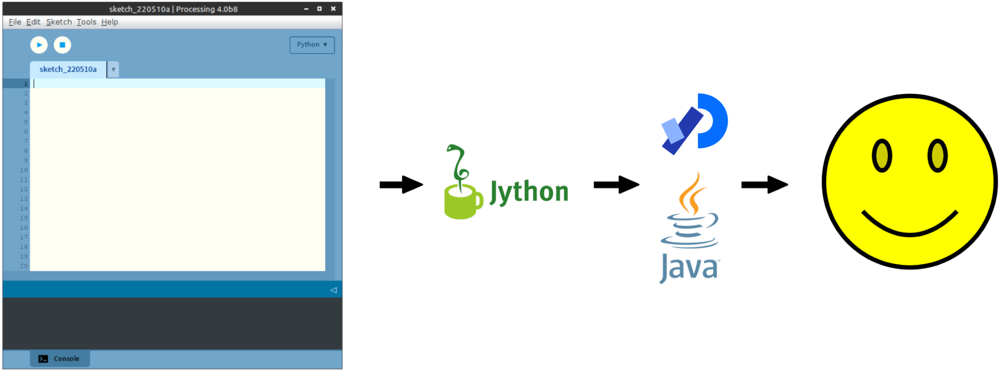

# ***Mitigating AI Misuse in Introductory Python Courses with Graphical Programming Tasks***
<!-- 
_backgroundImage: "url(./theme/tabreturn_title_bg.png)"
_backgroundRepeat: "repeat"
_backgroundSize: "325px"
_color: var(--color-background)
-->
*Kiwi Pycon 2025*

---

# Introduction
<!-- 
paginate: true 
backgroundColor: darkslategrey
color: var(--color-background)
-->

---

## Introduction > me
* Graphic designer → web designer → web designer & developer → multimedia developer → 
* Lecturer in Creative Technologies / Interaction Design
* Increasing grappling with what to teach and how to teach it ...
* Active in open-source development, and author of Python book

---

## Introduction > Processing
### ... anybody heard of it?
* Free, open-source programming tool made for visual arts and creative coding
* Easy to learn, especially for beginners learning graphics and interaction
* Great for coding animations, generative art, data visualisations
* Based on Java with simple functions for drawing and motion (like `setup()` and `draw()`)

---

<!-- 
_paginate: false
backgroundColor: white
-->

> https://processing.org

---

## Introduction > Processing derivatives
- <highlight>p5.js</highlight> -- JavaScript version for the web (runs in browsers)
- <highlight>Processing for Android</highlight> -- Create and run sketches on Android devices
- <highlight>OpenFrameworks</highlight> -- C++ creative coding toolkit inspired by Processing
* <highlight>Processing.py</highlight>  Uses Python instead of Java
<!--
- OpenFrameworks not actually mananged by Processing Foundation
-->

---

<!-- 
_paginate: false
backgroundColor: white
-->

<
<!--
- mention that development on this ceased a few years back
- also the limitations: no Python 3, and no Python libraries with C extentions (like NumPy)
-->

---

<!-- 
_paginate: false
backgroundColor: white
-->

---

## Introduction > Thonny-py5mode
* Leverages the py5 library, which incorporates JPype
* JPype supports Python 3
* JPype supports 3rd-party Python libraries with C extensions
* py5 includes Jupyter Notebook integration
* more at https://py5coding.org
<!--
- [NEXT SLIDE] conceptual overview
-->

---

<!-- 
_paginate: false
backgroundColor: white
-->

---

# Assessment
<!-- 
paginate: true 
backgroundColor: darkred
color: var(--color-background)
-->

---

## Assessment > Challenges
- Tools like Copilot, Codeium, and Anaconda Assistant embed AI help.
- GenAI aids debugging, syntax correction, and explanation.
- Limitations: weak reasoning, over-reliance risk.

---

## Assessment > Opportunities

- GPT-4 close to human tutors for hints/debugging
- Chatbots (e.g., Graasp Bot) help beginners, less so for complex tasks
- Students appreciate GenAI but fear accuracy and fairness issues
- LLM assistants are converging with Intelligent Tutoring Systems (ITS)
- Systems like PyTutor improve engagement/performance but risk dependence

---

## Assessment > Python & Creative Coding

- ShiffBot (p5.js): AI tutor based on Daniel Shiffman's teaching.
- Uses Retrieval-Augmented Generation for context-aware help.
- No Python equivalent yet, but py5 + Anaconda Assistant shows potential.
---

<!-- 
_paginate: false
backgroundColor: white
-->

> https://shiffbot.withgoogle.com

---

## Assessment > Strategies > 1. Code Tracking & Authorship
- Stylometric analysis of code patterns.
- Logging edit histories; staged submissions.
- Secure, proctored exams (ethical concerns noted).

---

## Assessment > Strategies > 2. Integrity Culture & Engagement
- Clear policies on AI use and citation.
- Reflection tasks and honour pledges.
- Encourage help-seeking, discuss ethical use.

---

<!-- 
_paginate: false
backgroundColor: white
-->

> https://shiffbot.withgoogle.com

---

## Assessment > Strategies > 3. Assessment Design & Exposition
- Personalised or parameterised tasks.
- Reflective and viva assessments.
- Scaffolded deliverables and code reviews.

---

**4. Graphical Programming as a Mitigation**
- Visual-output Python tasks (e.g., py5) harder for LLMs to solve.
- McDanel & Novak (2025): Visual tasks break AI accuracy.
- Thonny-py5mode assessment (Weeks 5–8) tested six visual challenges.
- LLMs (Claude, Gemini, GPT-4o) all failed to reproduce graphics reliably.
  - Missed shapes, colours, layering.
  - Outputs appeared as flawed approximations.

---

**Future Work**
- Test iterative prompting and documentation context.
- Compare py5, p5.js, Pillow for visual reasoning.
- Explore animation and personalised variants.
- Develop grading rubrics balancing code vs visual output.

---

---

# The Challenge
<!-- 
paginate: true 
backgroundColor: darkred
color: var(--color-background)
-->

---

## The Challenge > Assessment Q.1.1

1. *Print first 10 numbers using while loop (e.g., 1, 2, 3, ..., 8, 9, 10)*
2. *Print first 10 even numbers using for loop (e.g., 2, 4, 6, ..., 20)*
3. *Print first 10 odd numbers using while loop (e.g., 1, 3, 5, ..., 19)*
4. ...
<!-- 
- notes
-->

---

<!--
_backgroundColor: white
_paginate: false
-->

* <svg data-marpit-svg class="absolute">
    <rect x="617" y="210" width="250" height="160" style="fill:none;stroke:lime;stroke-width:5" />
  </svg>
> source url
<!--
- notes
-->

---

# section 2 title
<!-- 
backgroundColor: darkgoldenrod
color: var(--color-background)
-->

---

## section 2 title > subsection 2.1
lorem ipsum
<!-- 
- notes
-->

---

## *end*
<!-- 
paginate: false 
backgroundColor: black
color: var(--color-background)
-->

